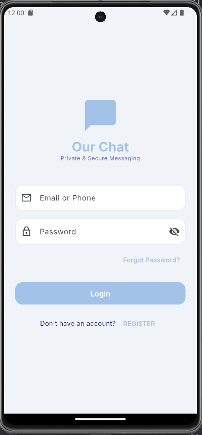
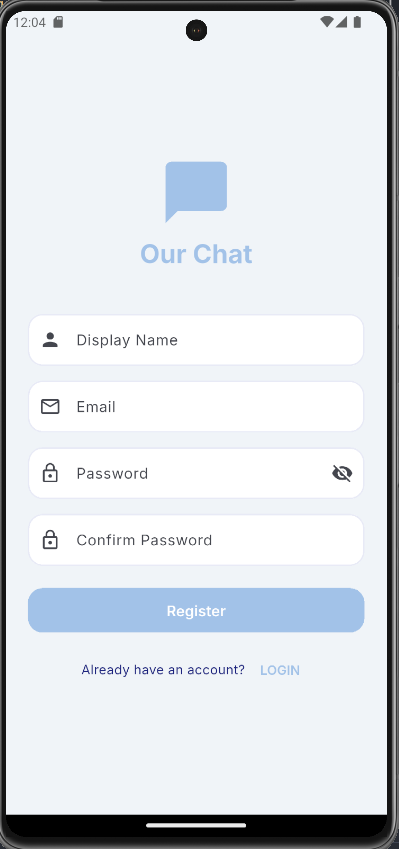
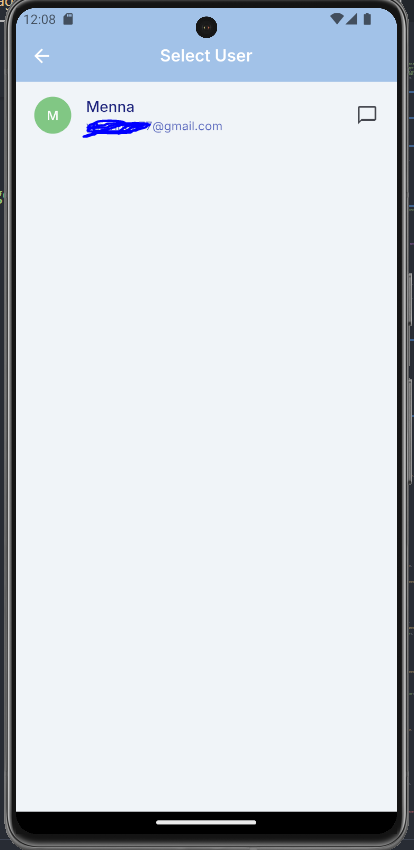
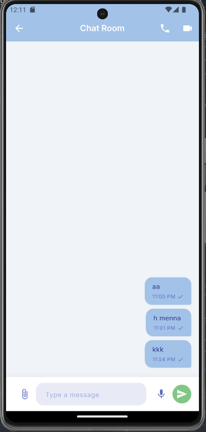
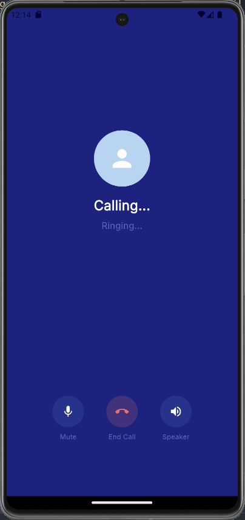
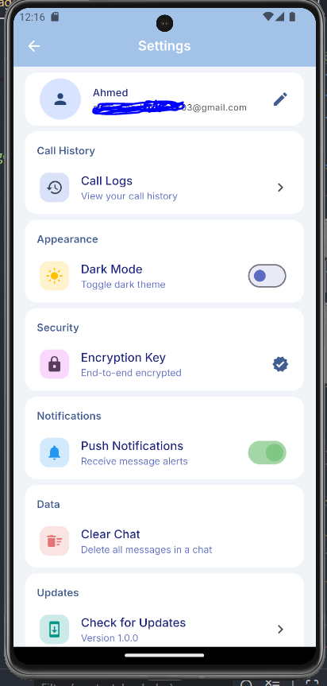
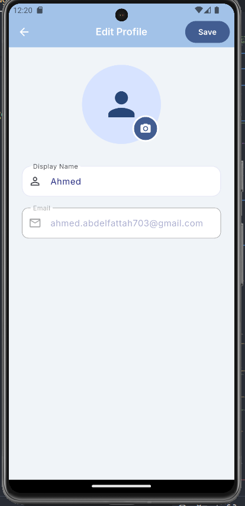
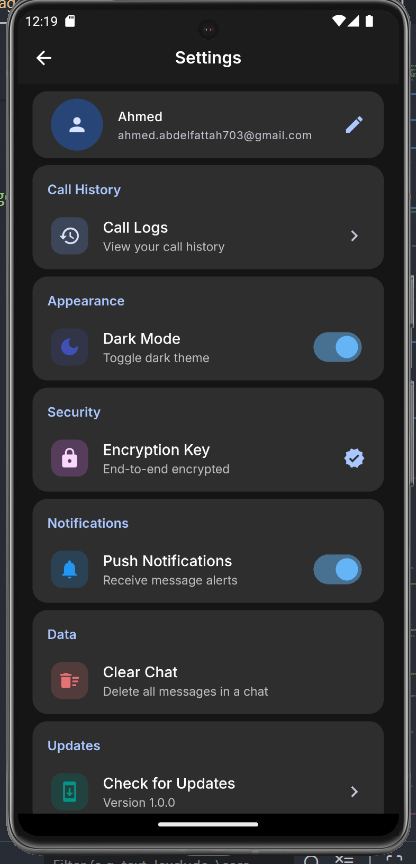
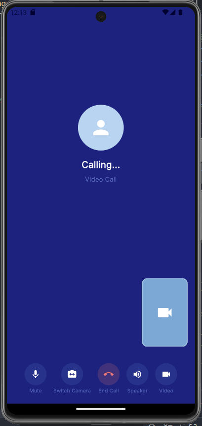

# Flutter Communication Suite

A professional, high-performance communication application built with Flutter, leveraging **Clean Architecture** and the **BLoC/Cubit** pattern. This project is designed to provide a seamless messaging and call experience with a focus on scalability and clean code.

## 🚀 Key Features
- **Authentication**: Secure login and registration flows.
- **Profile Management**: Complete user profile customization with image upload support.
- **Real-time Call Logs**: Paginated call history with real-time updates.
- **Chat Customization**: Advanced chat settings including room renaming and batch-delete functionality.
- **Dynamic Theming**: Smooth Light/Dark mode transitions persisted with SharedPreferences.
- **Material 3 Design**: A modern, clean, and intuitive user interface.

## 📱 Application Preview

| Login | Register | Select User |
| :---: | :---: | :---: |
|  |  |  |

| Chat Room | Call Logs | Settings |
| :---: | :---: | :---: |
|  |  |  |

| Edit Profile | Dark Mode | Video Call |
| :---: | :---: | :---: |
|  |  |  |

## 🛠 Tech Stack
- **Architecture**: Clean Architecture (Domain, Data, Presentation layers)
- **State Management**: BLoC / Cubit
- **Backend**: Firebase (Authentication, Firestore, Storage)
- **Local Persistence**: SharedPreferences
- **Design System**: Material 3

## 🏗 Project Structure
```text
lib/
├── core/           # Constants, themes, error handling
├── data/           # Models, Repositories, Data Sources
├── domain/         # Entities, UseCases, Repositories
├── presentation/   # Cubits, Pages, Widgets
└── injection_container.dart # DI Configuration
